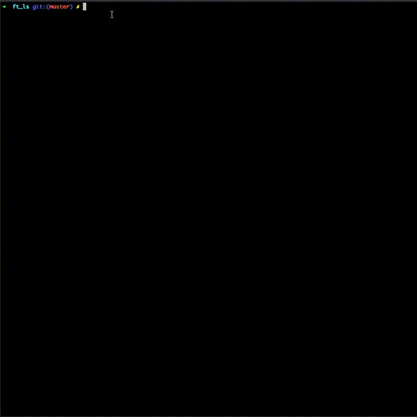
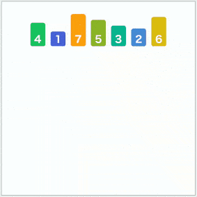

<strong><h1>Intro</h1></strong>

The ls command is one of the first commands everyone has to learn in order to use shell. It is
also probably the most used command of every programmer.
To Recode ls and some of its options will allow you to find out how to interact with
the file system using C. After all, you already know how to open, read, write and close a
file. But, what about the directories? Special files? Rights, dates or sizes of the files?
And while I am on the topic, the quality of your libft will make the difference
between a pleasant project experience and an abominable one. For example, if you add
ft_printf to your libft, your life will be more enjoyable. The ft_ls project is totally
doable without ft_printf, in the same way that you can eat yogurt with your fingers.
But having a spoon still helps a lot....

<strong style="underline">It's a smaller version of ls, flags that are currently working -> -GRalrt</strong>
 
-a (Include directory entries whose names begin with a dot (.))
 
-l (List in long format.If the output is to a terminal, a total sum for all the file sizes is output on a line before the long listing.)
 
-r (Reverse the order of the sort to get reverse lexicographical order or the oldest entries first.)
 
-t (Sort by time modified (most recently modified first) before sorting the operands by lexicographical order.)
 
-R (Recursively list subdirectories encountered.)
 
-G (Enable colorized output)

<h4>How to install</h4>
1. `git clone` the repo  
2. complie the executable wiht `make`  
3. `./ft_ls` is ready to use with the flags shown in the usage bellow  

<strong>usage: ft_ls [-GRalrt] [file ...]</storng>

    

I used the merge sort (for linked list) algorithm for this project.  
MergeSort(headRef) 
1) If the head is NULL or there is only one element in the Linked List 
    then return.
2) Else divide the linked list into two halves.  
      FrontBackSplit(head, &a, &b); /* a and b are two halves */
3) Sort the two halves a and b.
      MergeSort(a);
      MergeSort(b);
4) Merge the sorted a and b (using SortedMerge() discussed here) 
   and update the head pointer using headRef.
     *headRef = SortedMerge(a, b);

    

<strong>Sources</strong>:

https://codeforwin.org/2018/03/c-program-to-list-all-files-in-a-directory-recursively.html 
https://stackoverflow.com/questions/3554120/open-directory-using-c 
https://stackoverflow.com/questions/8436841/how-to-recursively-list-directories-in-c-on-linux 
https://www.geeksforgeeks.org/merge-sort-for-linked-list/ 
https://stackoverflow.com/questions/2589533/what-is-a-cursor-linked-list-c 

Videos:
<a href="https://www.youtube.com/watch?v=7KTk8NVB1N8">Linux File Types</a>
